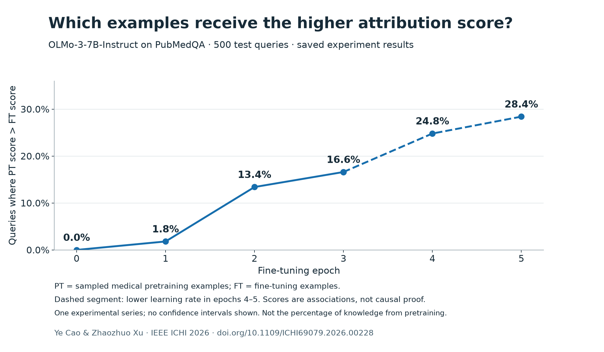
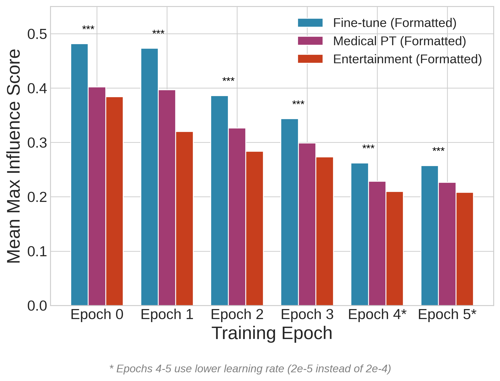
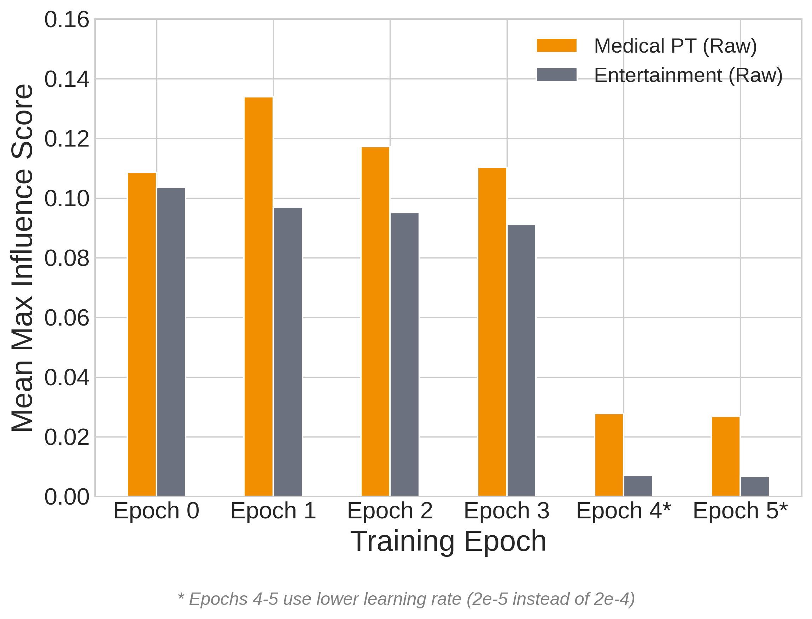
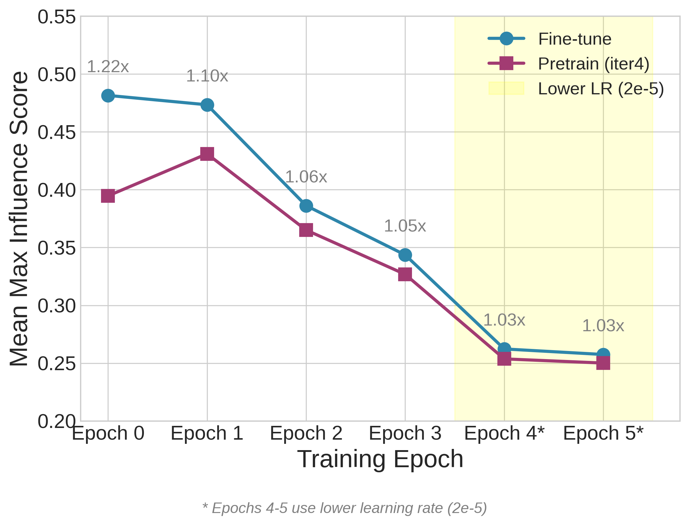
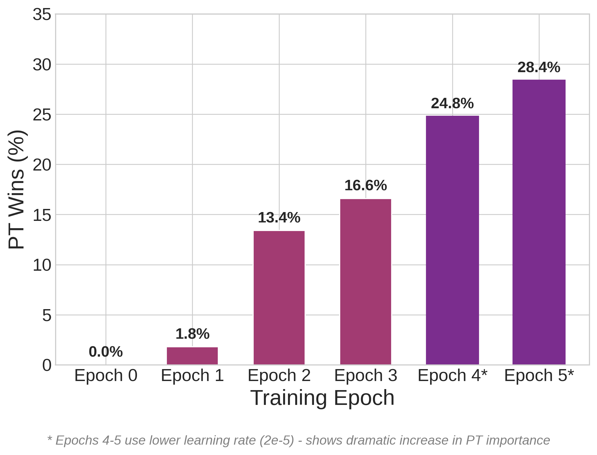
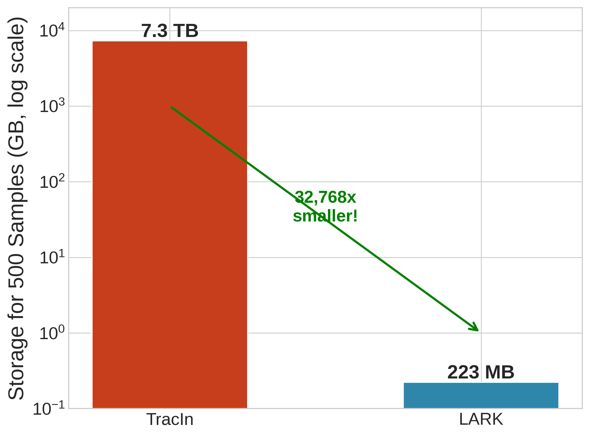
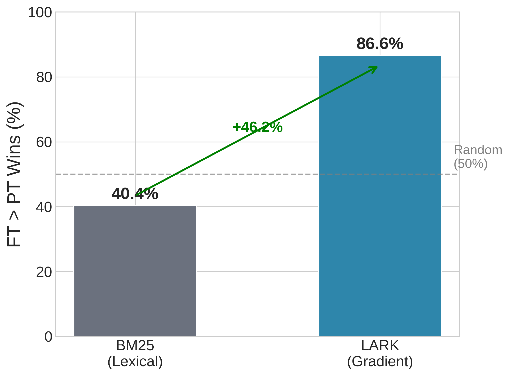

# Scalable Data Attribution for Biomedical QA

Research code and saved experiment results accompanying the IEEE ICHI 2026 paper:

**Scalable Data Attribution Reveals Fine-Tuning Unlocks LLM Pretrained Knowledge in Biomedical Question Answering**

The project studies whether a biomedical QA model's predictions are driven more by fine-tuning examples or by pretrained medical knowledge. The experiments use OLMo-3-7B-Instruct fine-tuned on PubMedQA and compare gradient-based attribution against lexical retrieval baselines.

**Authors:** Ye Cao and Zhaozhuo Xu

**Paper:** [IEEE Xplore](https://ieeexplore.ieee.org/document/11634855/) · [DOI](https://doi.org/10.1109/ICHI69079.2026.00228) · [BibTeX](paper.bib)

## Start here: reproduce the saved results on your laptop

Python 3.9+; no GPU, model download, or third-party package is needed:

```bash
git clone https://github.com/Mr-Ye-Cao/scalable-data-attribution-biomedical-qa.git
cd scalable-data-attribution-biomedical-qa
python3 scripts/demo_results.py --output results/demo-summary.json
```

This recomputes per-query comparisons from the archived scores. It does **not** retrain the model or recompute gradients. Expected PT-win percentages are `0.0, 1.8, 13.4, 16.6, 24.8, 28.4` across epochs 0–5. See [reproduction details and limitations](docs/REPRODUCING_RESULTS.md).



## Key Takeaways

| Question | Current Evidence |
| --- | --- |
| Can attribution separate medical from non-medical data? | Medical pretraining text has higher measured attribution scores than entertainment controls under matched formatting. At epoch 2, rounded mean maxima are `0.365` vs `0.284` (about `28.5%`; unrounded saved scores give `28.7%`). |
| Does pretraining influence change during fine-tuning? | PT wins rise from `0.0%` at baseline to `28.4%` by epoch 5, suggesting increasing use of pretrained medical knowledge as training progresses. |
| How do gradient and lexical source rankings differ? | LARK/RapidIn FT wins are `86.6%` at epoch 2, while BM25 FT wins are `40.4%`, a `46.2` percentage-point gap. This is a source-selection comparison, not measured accuracy against causal ground truth. |
| Is full-gradient attribution feasible? | Full-gradient TracIn for 500 samples is estimated at about `7.3 TB`; LARK/RapidIn projected storage is about `223 MB` for the same sample count. |

## Result Figures

| Result | Figure |
| --- | --- |
| Domain relevance with formatted data |  |
| Domain relevance without QA formatting |  |
| Fine-tune vs pretrain influence |  |
| PT wins over training |  |
| Storage efficiency |  |
| LARK vs BM25 attribution |  |

## Repository Layout

| Path | Purpose |
| --- | --- |
| `ICHI_Data_Valuation/` | LaTeX paper source, generated PDF, paper-ready figures, bibliography, and IEEE template assets. |
| `scripts/` | Data preparation, evaluation, attribution, BM25, TracIn-memory, and analysis scripts. |
| `configs/` | RapidIn/LARK experiment configs for baseline, checkpoints, controls, learning-rate variants, and validation runs. |
| `data-aggregate/` | Compact input samples, influence-score summaries, analysis JSON, and figure-generation scripts used by the paper. |
| `data-aggregate/DATA.md` | Data dictionary for the aggregate folder, including checkpoint names, source definitions, and JSON schemas. |
| `CMD.md` | Command log for data download, model evaluation, fine-tuning, RapidIn/LARK attribution, and monitoring long jobs. |
| `Medical-LLM-Fine-tuning/` | Submodule pointing to the fine-tuning framework used for OLMo/PubMedQA training. |
| `docs/BRANCH_MAP.md` | Guide to the remote branches and which one to use for each kind of follow-up. |
| `docs/CODE_GUIDE.md` | Quick guide to the training and attribution code paths. |
| `docs/REVIEW_RESPONSE_ROADMAP.md` | Reviewer-driven plan for strengthening the empirical evidence and tightening claims. |

## Code Entry Points

Initialize external code/model/data references:

```bash
git submodule update --init RapidIn Medical-LLM-Fine-tuning pubmedqa
```

Common entry points:

```bash
# Download PubMedQA
python scripts/data_prep/download_pubmedqa.py

# Evaluate base model outputs
python scripts/eval/eval_base_model.py

# Fine-tune via the Medical-LLM-Fine-tuning submodule
(cd Medical-LLM-Fine-tuning && python train.py --model_type olmo3-7b-instruct --subset pqa_labeled --epochs 3 --full_finetune)

# Run RapidIn/LARK attribution with a saved config
python scripts/attribution/run_rapidin_original.py --config configs/aligned_500/ckpt64_finetune.json
```

See `docs/CODE_GUIDE.md` and `CMD.md` for the fuller pipeline.

## Reproducing Display Figures

The display figures are already checked in. To regenerate them from the aggregate result constants:

```bash
python data-aggregate/generate_figures.py
```

The script writes into `ICHI_Data_Valuation/figures/`.

## Manuscript versions and limitations

The published record is linked above. `ICHI_Data_Valuation/main.pdf` is an archived six-page draft, not the three-page IEEE proceedings version. Its status as an accepted manuscript has not been verified. The reviews mostly ask for stronger validation of the attribution approximation, robustness across seeds/projection dimensions, clearer separation of content from format, stronger baselines, and toned-down causal language. See `docs/REVIEW_RESPONSE_ROADMAP.md` for a concrete follow-up plan.


## Attribution and reuse

The experiment pipeline builds on [RapidIn](https://github.com/huawei-lin/RapidIn), the fine-tuning submodule, PubMedQA, and OLMo. Cite and follow the terms of those projects as well as this paper when applicable. Submodules retain their own licenses. No repository-wide license is currently declared for the original material; public access alone does not grant an unrestricted reuse license. Paper text, source datasets, and model weights have separate terms.
